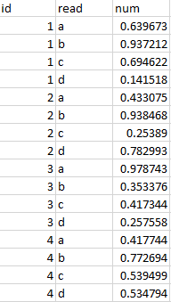
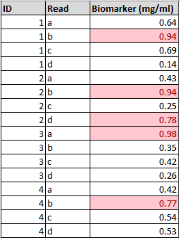

### The concept of raw data

The term 'raw data' is common and often heard in many different contents. However, when there is no agreed definition of what this actually means, problems can arise.

Raw data means unedited and unprocessed. It is the file that the instrument exports, or the file that you download from a cloud-based sensor, or the base file that you've created by manually entering 
some figures. The simpler the file format, the more useful the data. For example, raw data in the form of open file formats such as .CSV or .TXT can be opened by a wide range of programs. Raw 
data may well be messy and require considerable processing before it becomes useful. Other names for raw data are source data or primary data.

Sometimes, raw data will not be in a simple, open file format. For example, if the data comes from a piece of lab equipment in a proprietary file format. In cases such as these, the files
should still be kept exactly as they are and refered to as the raw data. Conversion to an open file format may be possible, and may form the basis of all consequency analysis. However, this is
then *not* the raw data.

### The importance of raw data

One key aspect to modern data analysis is the idea of reproducibility. In other words, being able to understand what has been done to data, and to possibly recreate the workflow. The only way to ensure this
is to start with the raw data and turn it into the final output (whether this is a table, a plot, or simply a clearer dataset for some other, future use) via a series of steps.

First, if you begin this process with data that has already been edited, processed and cleaned in a number of unknown ways, you may never be able to fully reproduce the workflow. Second, the processing
may mean that the data is then harder to work with in certain situations (for example, converting a CSV file into an XLS file, containing formatting, makes it more difficult to deal with in code-based
analysis environments such as R or Python).

Raw data,

Not raw data,

